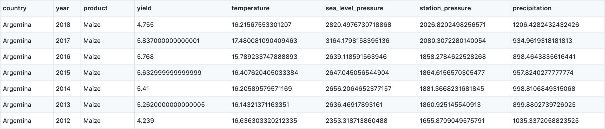

# Влияние изменения климата на урожайность

## Авторы
Глебов Сегрей, Золин Игорь, Кузнецов Марк, Неганов Лев, Санжиев Евгений

## Описание

Датасет содержит информацию об урожайности сельскохозяйственных культур и среднегодовых температур в нескольких странах в период с 2000 по 2018 гг. Такой датасет позволит проанализировать как изменение температуры влияет на урожайность.

### Список стран:
- Турция
- Украина
- Египет
- Казахстан 
- Мексика 
- ЮАР
- Аргентина
- Австралия
- Бразилия
- Канада

### Список сельскохозяйственных культур
- Кукуруза
- Рис
- Соя
- Пшеница

## Структура
Датасет состоит из следующих колонок:
|Название|Описание|
|---|---|
|country|Название страны наблюдения|
|year|Год наблюдения|
|product|Название культуры|
|yield|Урожайность культуры, Т/Га|
|temperature|Среднегодовая температура, °C|
|sea_level_pressure|Среднегодовое давление на уровне моря по стране, мбар|
|station_pressure|Среднегодовое давление по стране в общем, мбар|
|precipitation|Годовой объем осадков, мм|

### Пример датасета

**Датасет**: [https://github.com/seaone/12_team_hak_19_10/blob/main/final_dataset.csv](https://github.com/seaone/12_team_hak_19_10/blob/main/final_dataset.csv)

## Источники
В качестве источника данных о климате используются сайт [https://www.data.gov/](https://www.data.gov/). Данные об урожайности сельскохозяйственных культур взяты из сайта: [http://www.amis-outlook.org/](http://www.amis-outlook.org/)

